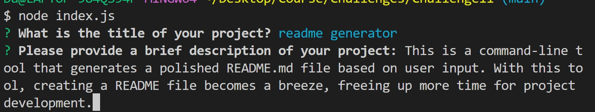
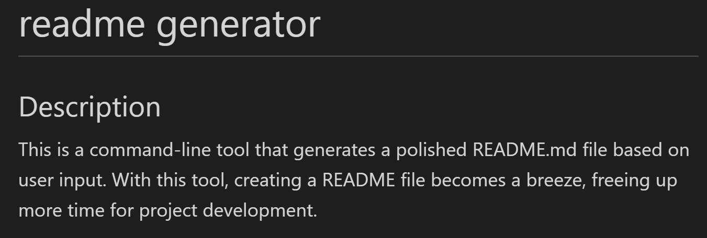
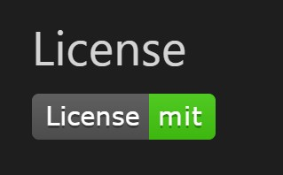

  # readme generator
  
  ## Description
  This project is a command-line application that dynamically generates a professional README.md file from a user's input. You can quickly and easily create a README file by using a command-line application to generate one. It allows the project creator to devote more time to working on the project.
  
  ## Table of Contents
  - [Installation](#installation)
  - [Usage](#usage)
  - [License](#license)
  - [Contributing](#contributing)
  - [Tests](#tests)
  - [Questions](#questions)
  - [Screenshots](#screenshots)
  
  ## Installation
  To install this project, follow these steps:

Clone the repository onto your local machine.
Navigate to the project directory.
Install the required dependencies by running the command npm install.
Run the project by executing the command npm start.
If you encounter any issues during the installation process, please refer to the project documentation or open an issue in the project's issue tracker.
  
  ## Usage
  To use this project, follow these steps:

1. Clone the repository to your local machine using git clone https://github.com/damianfearon/repo.git
2. Install the necessary dependencies by running npm install in the project directory
3. Start the application by running npm start in the project directory
4. Execute index.js by typing 'node index.js'
5. Answer the questions. 
</br>
</br>
  
  ## License
  
  
  ## Contributing

Contributions are welcome and encouraged! Please follow these guidelines when contributing to this project:

1. Fork the repository and create your branch from `main`.
2. If you've added code that should be tested, please add tests.
3. Ensure that your code passes all tests.
4. Submit a pull request.

Thank you for contributing to this project!

  
  
  ## Tests
  1. To run tests for this project, first ensure that all dependencies are installed by running:
  ``` sh
npm install
```
2. Then, run the tests with:
  ``` sh
npm run test
```

  
  ## Questions
  If you have any questions, please contact Damian Fearon at damianfearon@hotmail.com.
  
  ## Screenshots
 <h3> Preview of the questions </h3>
  
 </br>
 </br>


 <h3> Example of the generated readme  </h3>
  
 </br>
  </br>
  <h3> License generated by user</h3>
  


